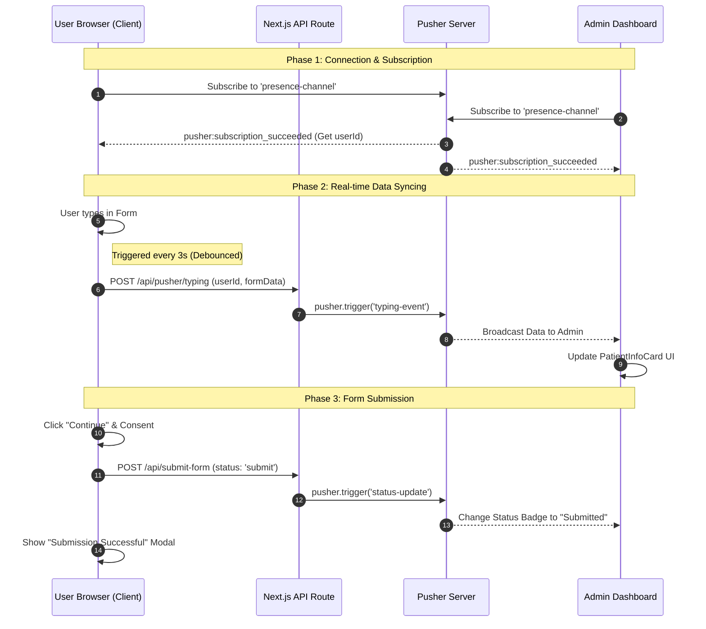

# HealthTrack Web

ระบบจัดการข้อมูลสุขภาพของผู้ป่วยที่พัฒนาด้วย Next.js รองรับการซิงค์ข้อมูลแบบ real-time ระหว่างผู้ใช้งานและแอดมิน

## 🚀 เริ่มต้นใช้งาน

### ข้อกำหนดเบื้องต้น

- Node.js 18+
- pnpm (recommended) or npm/yarn

### การติดตั้ง

```bash
# Install dependencies
pnpm install

# Set up environment variables
cp .env.example .env.local
```

### เซิร์ฟเวอร์พัฒนา

```bash
pnpm dev
```

เปิด [http://localhost:3000](http://localhost:3000) เพื่อดูแอปพลิเคชัน

### การ Build และ Production

```bash
pnpm build
pnpm start
```

## 📁 Project Structure

```
healthtrack-web/
├── app/                          # Next.js App Router
│   ├── layout.tsx               # Root layout with Prompt font
│   ├── page.tsx                 # Home page
│   ├── form/                    # Patient form page
│   ├── admin/                   # Admin dashboard
│   └── api/                     # API routes
│       ├── submit-form/         # Form submission endpoint
│       └── pusher/              # Real-time sync endpoints
│           ├── auth/            # Pusher authentication
│           └── typing/          # Real-time typing indicators
├── components/                   # Reusable React components
│   ├── PatientInfoCard.tsx      # Display patient information
│   ├── StatusTag.tsx            # Display form status badges
│   ├── Icon.tsx                 # SVG icons collection
│   └── ui/                      # UI primitive components
│       ├── Button.tsx           # Customizable button
│       ├── Input.tsx            # Form input field
│       ├── Modal.tsx            # Modal dialog
│       ├── RadioGroup.tsx       # Radio button group
│       ├── Select.tsx           # Dropdown select
│       └── Table.tsx            # Data table component
├── config/                       # Configuration files
│   └── pusher.ts                # Pusher client & server setup
├── constant/                     # Application constants
│   ├── nationality.constant.ts  # Nationality options
│   └── validate.constant.ts     # Validation rules
├── enum/                         # TypeScript enums
│   └── form.enum.ts             # Form-related enums
├── types/                        # TypeScript type definitions
    └── data.type.ts             # Data models & interfaces

```

## 🎨 Design

### Responsive Design

- **Breakpoints**: ใช้ Tailwind CSS breakpoints ที่ 768px (md) เป็นหลัก เพื่อสลับ layout ระหว่าง mobile/desktop

## 🏗️ Component Architecture

```
Root Layout
├── Page (Home)
├── Form Page
│   └── Form Components
│       ├── Input Fields (controlled by react-hook-form)
│       ├── RadioGroup (Gender selection)
│       └── Select (Nationality dropdown)
├── Admin Page
│   └── PatientInfoCard (displays patient data)
│       └── StatusTag
└── API Routes (Backend logic)
    ├── Submit Form Handler
    └── Pusher Authentication
```

### Main component

#### **PatientInfoCard**

แสดงข้อมูลผู้ป่วยด้วย card ที่จะแสดงเฉพาะในหน้า mobile รวมถึง:

- รูปภาพตัวแทนของโปรไฟล์พร้อมไอคอน
- ชื่อผู้ป่วยและวันเกิด
- เลย์เอาต์กริดมีเพศ สัญชาติ โทรศัพท์ อีเมล
- ป้ายสถานะแสดงสถานะการส่งแบบฟอร์ม

#### **StatusTag**

แสดงผลป้ายสถานะมีสีตามสถานะฟอร์ม:

- รองรับสถานะฟอร์มต่างๆ จาก enum `EFormStatus`

#### **Form Components (ui/)**

- **Input.tsx**
- **Button.tsx**
- **RadioGroup.tsx**
- **Select.tsx**
- **Modal.tsx**
- **Table.tsx**

### Type of Components

- **Page Components**: แสดงหน้า page จัดการการดึงข้อมูลและลอจิกธุรกิจ (เช่น จัดการการส่งแบบฟอร์ม)
- **Presentational Components**: รับข้อมูลผ่าน props และเน้นการแสดงผล (เช่น `PatientInfoCard`)
- **Shared Components**: UI primitives ที่นำกลับมาใช้ได้ตลอดโปรเจกต์

### Form management

แอปพลิเคชันใช้ **react-hook-form** เพื่อจัดการสถานะฟอร์มอย่างมีประสิทธิภาพ:

- การ re-render น้อยที่สุด
- รองรับการ validate form

## 🔄 Real-Time Syncronization flow

มีการใช้ **Pusher** เพื่อซิงค์ข้อมูลของผู้ป่วยระหว่างผู้ใช้งานหลายคนและเซสชันต่างๆ แบบ real-time



### Data flow

#### 1. **Client connection & authentication**

```typescript
// Client connects to Pusher with auth
const pusherClient = new PusherClient(NEXT_PUBLIC_PUSHER_APP_KEY, {
  cluster: "ap1",
  authEndpoint: "/api/pusher/auth", // Backend authentication
});
```

#### 2. **Subscribe to channel (Presence Channel)**

```typescript
// Subscribe to presence-channel for user awareness
const channel = pusherClient.subscribe("presence-channel");

// Automatically triggers auth at: POST /api/pusher/auth
// Server generates unique user ID and presence data
```

**Auth Endpoint** (`/api/pusher/auth`):

- รับ Socket ID และชื่อช่องจาก client
- สร้างรหัสผู้ใช้ที่ไม่ซ้ำกัน: `u-{randomNumber}`
- ช่วยให้ Pusher สามารถ track user ที่ active/inactive ได้

#### 4. **Real-time updating form with values**

```typescript
// Endpoint for typing status: POST /api/pusher/typing
// Broadcasts real-time typing events to show which users are active
pusherServer.trigger("presence-channel", "user-typing", {
  id: userId,
  data: formData,
});
```

#### 4. **Real-time submit form**

```typescript
// User submits form (update status to submit and send completed form values)
POST /api/submit-form
  ├─ Request: { id, status, formData... }
  ├─ Trigger Pusher event:
  │   pusherServer.trigger("presence-channel", "form-submitted", {
  │     id: formData.id,
  │     status: formData.status,
  │     formData: formData,
  │     submittedAt: timestamp
  │   })
  └─ Response: { status: "Form submitted!" }
```

## 🛠️ เทคโนโลยีที่ใช้

| ชั้น                | เทคโนโลยี                     |
| ------------------- | ----------------------------- |
| **Framework**       | Next.js 16.1.6                |
| **UI Library**      | React 19.2.3                  |
| **Language**        | TypeScript 5                  |
| **Form Management** | React Hook Form 7.71.2        |
| **Real-time**       | Pusher 5.3.2, Pusher-JS 8.4.0 |
| **Styling**         | Tailwind CSS 4                |
| **Font**            | Prompt (Google Fonts)         |
| **Linting**         | ESLint 9                      |
